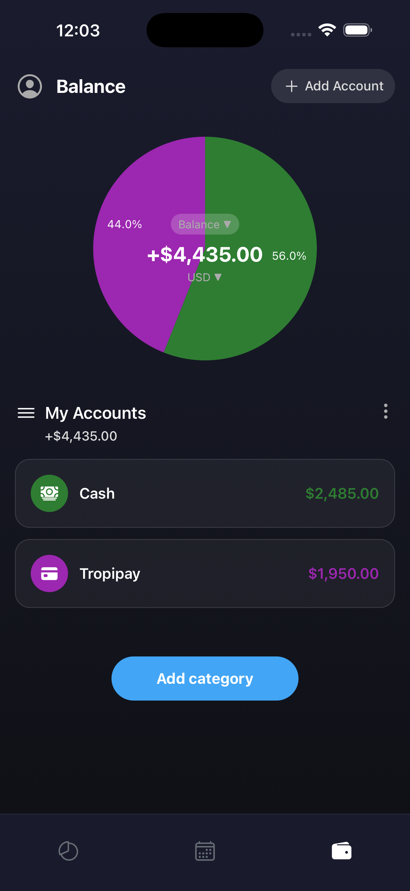
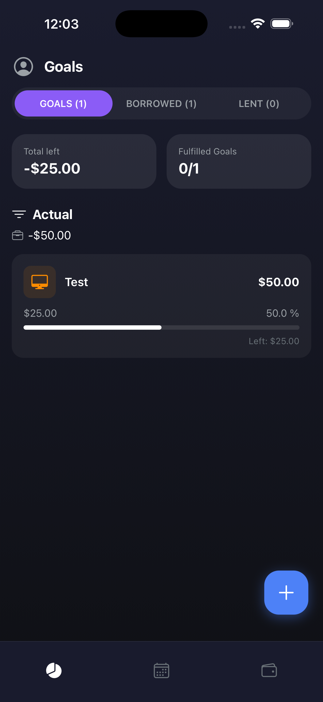
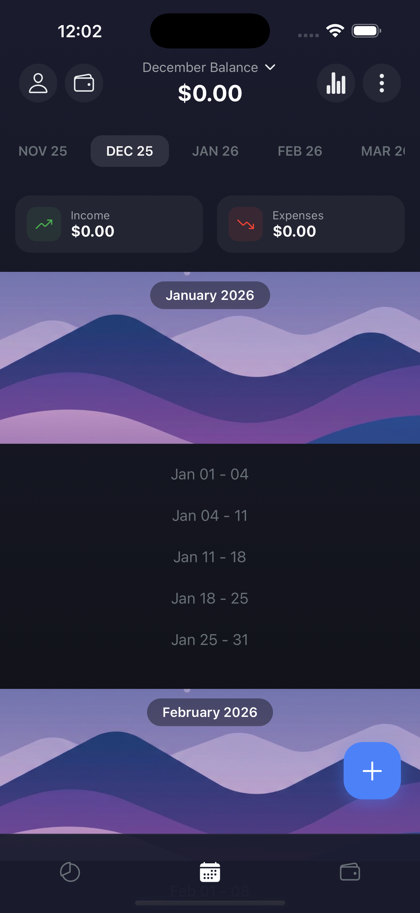

# MoneyFlow

MoneyFlow is a comprehensive personal finance management application designed to help users track their income, expenses, and financial goals. Built with modern mobile technologies, it offers a clean and intuitive interface for managing personal finances.

## Features

The application is structured into several core modules:

- **Auth**: User authentication and session management.
- **Balance**: Overview of current financial status and account balances.
- **Income**: Track and manage various sources of income.
- **Expenses**: Log and categorize daily expenses.
- **Goals**: Set and track progress towards financial goals.
- **Calendar**: Visual overview of financial activities by date.
- **Categories**: Manage custom categories for income and expenses.
- **Profile**: User profile settings and preferences.

## Technology Stack

- **Framework**: [React Native](https://reactnative.dev/) with [Expo](https://expo.dev/)
- **Language**: [TypeScript](https://www.typescriptlang.org/)
- **State Management**: [MobX](https://mobx.js.org/) (Project uses MVVM pattern)
- **Dependency Injection**: [InversifyJS](https://inversify.io/)
- **Navigation**: [React Navigation](https://reactnavigation.org/) / [Expo Router](https://docs.expo.dev/router/introduction/)
- **UI Components**: `@expo/vector-icons`, `react-native-svg`

## Architecture

The project follows a **Modular Clean Architecture** with **MVVM** pattern:

- **Domain**: Business logic and entities (Independent).
- **Data**: repositories implementations and API calls.
- **Presentation**: UI (Screens/Components) and ViewModels (MobX).
- **DI**: InversifyJS used for loose coupling between layers.

## Get Started

1. **Install dependencies**

   ```bash
   npm install
   ```

2. **Start the app**

   ```bash
   npx expo start
   ```

   In the output, you'll find options to open the app in a
   - [development build](https://docs.expo.dev/develop/development-builds/introduction/)
   - [Android emulator](https://docs.expo.dev/workflow/android-studio-emulator/)
   - [iOS simulator](https://docs.expo.dev/workflow/ios-simulator/)
   - [Expo Go](https://expo.dev/go)

## Project Structure

```bash
src/
├── app/            # App setup, DI container, navigation
├── modules/        # Feature modules (Auth, Expenses, etc.)
│   ├── [module]/
│   │   ├── domain/       # Models, UseCases, Repository Interfaces
│   │   ├── data/         # API, Mappers, Repository Implementations
│   │   └── presentation/ # Screens, Components, ViewModels
├── shared/         # Shared UI, hooks, utils
└── index.tsx       # Entry point
```

## Screenshots

| Wallets | Goals | Calendar |
|---|---|---|
|  |  |  |
